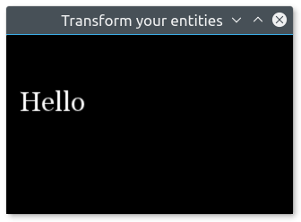
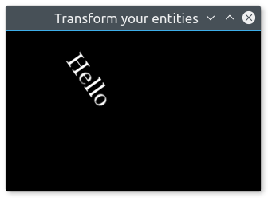
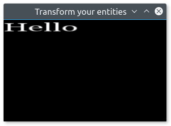
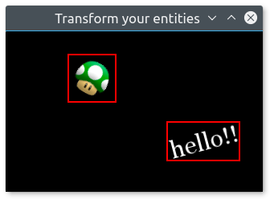

# Position, rotation, scale: Transforming entities

Relevant example: **[transformable]({{book.examples}}/transformable.cr)**

## Transforming CrSFML entities

All CrSFML classes (sprites, text, shapes) use the same interface for transformations: [TransformableM]({{book.api}}/TransformableM.html). This module provides a simple API to move, rotate and scale your entities. It doesn't provide maximum flexibility, but instead defines an interface which is easy to understand and to use, and which covers 99% of all use cases -- for the remaining 1%, see the last chapters.

[TransformableM]({{book.api}}/TransformableM.html) (and all classes that include it) defines four properties: **position**, **rotation**, **scale** and **origin**. They all have their respective getters and setters. These transformation components are all independent of one another: If you want to change the orientation of the entity, you just have to set its rotation property, you don't have to care about the current position and scale.

### Position

The position is the... position of the entity in the 2D world. I don't think it needs more explanation :).

```crystal
# 'entity' can be a SF::Sprite, a SF::Text, a SF::Shape or any other transformable class

# set the absolute position of the entity
entity.position = SF.vector2(10, 50)

# move the entity relatively to its current position
entity.move(SF.vector2(5, 5))

# retrieve the absolute position of the entity
position = entity.position # = (15, 55)
```



By default, entities are positioned relative to their top-left corner. We'll see how to change that with the 'origin' property later.

### Rotation

The rotation is the orientation of the entity in the 2D world. It is defined in *degrees*, in clockwise order (because the Y axis is pointing down in SFML).

```crystal
# 'entity' can be a SF::Sprite, a SF::Text, a SF::Shape or any other transformable class

# set the absolute rotation of the entity
entity.rotation = 45

# rotate the entity relatively to its current orientation
entity.rotate(10)

# retrieve the absolute rotation of the entity
rotation = entity.rotation # = 55
```



Note that SFML always returns an angle in range [0, 360) when you call `rotation`.

As with the position, the rotation is performed around the top-left corner by default, but this can be changed by setting the origin.

### Scale

The scale factor allows the entity to be resized. The default scale is 1. Setting it to a value less than 1 makes the entity smaller, greater than 1 makes it bigger. Negative scale values are also allowed, so that you can mirror the entity.

```crystal
# 'entity' can be a SF::Sprite, a SF::Text, a SF::Shape or any other transformable class

# set the absolute scale of the entity
entity.scale = SF.vector2(4.0, 1.6)

# scale the entity relatively to its current scale
entity.scale(SF.vector2(0.5, 0.5))

# retrieve the absolute scale of the entity
scale = entity.scale # = (2, 0.8)
```



### Origin

The origin is the center point of the three other transformations. The entity's position is the position of its origin, its rotation is performed around the origin, and the scale is applied relative to the origin as well. By default, it is the top-left corner of the entity (point (0, 0)), but you can set it to the center of the entity, or any other corner of the entity for example.

To keep things simple, there's only a single origin for all three transformation components. This means that you can't position an entity relative to its top-left corner while rotating it around its center for example. If you need to do such things, have a look at the next chapters.

```crystal
# 'entity' can be a SF::Sprite, a SF::Text, a SF::Shape or any other transformable class

# set the origin of the entity
entity.origin = SF.vector2(10, 20)

# retrieve the origin of the entity
origin = entity.origin # = (10, 20)
```

Note that changing the origin also changes where the entity is drawn on screen, even though its position property hasn't changed. If you don't understand why, read this tutorial one more time!

## Transforming your own classes

[TransformableM]({{book.api}}/TransformableM.html) is not only made for CrSFML classes, it can also be included in your own classes (or be a member, using [Transformable]({{book.api}}/Transformable.html)).

```crystal
class MyGraphicalEntity
  include SF::TransformableM

  # ...
end

entity.position = SF.vector2(10, 30)
entity.rotation = 110
entity.scale = SF.vector2(0.5, 0.2)
```

To retrieve the final transform of the entity (commonly needed when drawing it), call the `transform` method. This method returns a [Transform]({{book.api}}/Transform.html) object. See below for an explanation about it, and how to use it to transform an SFML entity.

If you don't need/want the complete set of methods provided by the [TransformableM]({{book.api}}/TransformableM.html) interface, don't hesitate to simply use it as a member instead and provide your own methods on top of it. It is not abstract, so it is possible to instantiate it ([Transformable]({{book.api}}/Transformable.html)) instead of only being able to use it as a module.

## Custom transforms

The [Transformable]({{book.api}}/Transformable.html) class is easy to use, but it is also limited. Some users might need more flexibility. They might need to specify a final transformation as a custom combination of individual transformations. For these users, a lower-level class is available: [Transform]({{book.api}}/Transform.html). It is nothing more than a 3x3 matrix, so it can represent any transformation in 2D space.

There are many ways to construct a [Transform]({{book.api}}/Transform.html):

* by using the predefined methods for the most common transformations (translation, rotation, scale)
* by combining two transforms
* by specifying its 9 elements directly

Here are a few examples:

```crystal
# the identity transform (does nothing)
t1 = SF::Transform::Identity

# a rotation transform
t2 = SF.transform
t2.rotate(45)

# a custom matrix
t3 = SF.transform(2, 0, 20, 0, 1, 50, 0, 0, 1)

# a combined transform
t4 = t1 * t2 * t3
```

You can apply several predefined transformations to the same transform as well. They will all be combined sequentially:

```crystal
t = SF.transform
t.translate(10, 100)
t.rotate(90)
t.translate(-10, 50)
t.scale(0.5, 0.75)
```

Back to the point: How can a custom transform be applied to a graphical entity? Simple: Pass it to the draw method.

```crystal
states = SF::RenderStates.new
states.transform = transform
window.draw(entity, states)
```

If your entity is a [Transformable]({{book.api}}/Transformable.html) (sprite, text, shape), which contains its own internal transform, both the internal and the passed transform are combined to produce the final transform.

## Bounding boxes

After transforming entities and drawing them, you might want to perform some computations using them e.g. checking for collisions.

SFML entities can give you their bounding box. The bounding box is the minimal rectangle that contains all points belonging to the entity, with sides aligned to the X and Y axes.



The bounding box is very useful when implementing collision detection: Checks against a point or another axis-aligned rectangle can be done very quickly, and its area is close enough to that of the real entity to provide a good approximation.

```crystal
# get the bounding box of the entity
bounding_box = entity.global_bounds

# check collision with a point
point = ...

if bounding_box.contains(point)
  # collision!
end

# check collision with another box (like the bounding box of another entity)
other_box = ...

if bounding_box.intersects(other_box)
  # collision!
end
```

The method is named `global_bounds` because it returns the bounding box of the entity in the global coordinate system, i.e. after all of its transformations (position, rotation, scale) have been applied.

There's another method that returns the bounding box of the entity in its *local* coordinate system (before its transformations are applied): `local_bounds`. This method can be used to get the initial size of an entity, for example, or to perform more specific calculations.

## Object hierarchies (scene graph)

With the custom transforms seen previously, it becomes easy to implement a hierarchy of objects in which children are transformed relative to their parent. All you have to do is pass the combined transform from parent to children when you draw them, all the way until you reach the final drawable entities (sprites, text, shapes, vertex arrays or your own drawables).

```crystal
# the abstract base class
class Node
  # ... methods to transform the node

  # ... methods to manage the node's children

  def draw(target, parent_transform)
    # combine the parent transform with the node's one
    combined_transform = parent_transform * @transform

    # let the node draw itself
    on_draw(target, combined_transform)

    # draw its children
    @children.each do |child|
      child.draw(target, combined_transform)
    end
  end

  private def on_draw(target, transform)
    ...
  end
end

# a simple derived class: a node that draws a sprite
class SpriteNode < Node
  # .. methods to define the sprite

  private def on_draw(target, transform)
    target.draw(@sprite, transform)
  end
end
```

